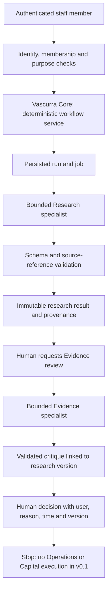

# VeyAI v0.1 — approved architecture proposal and review history

> Later on 7 October 2026 the founder approved developing the wider product
> against fixture providers, including explicitly labelled local identity/MFA
> simulations. This supersedes the no-development-login restriction below for
> local development only. Production identity and live-activation requirements
> remain. See [external provider architecture](external-provider-architecture.md).

Status: approved for the bounded first implementation slice; live activation
and production release are not approved by this document.
Original inspection: 6 October 2026. Approval record updated: 7 October 2026.

The original review below describes the repository as inspected on 6 October,
before implementation. Its statements about missing packages, routes and
database code are historical findings, not the current implementation status.
The original pass changed this document only and stopped for review as requested.
See [the implementation record](veyai-v0.1-implementation.md) for what now exists,
what remains unavailable and the setup and activation gates.

## Founder approval and locked constraints — 7 October 2026

The founder approved implementation of Research → Evidence → Human Decision,
with identity, MFA and explicit roles first; mandatory source provenance;
versioned contracts, instructions, models, source sets, outputs, critiques and
decisions; synthetic fixtures before meaningful private content; and hard run
and user budgets before live model execution. Veya and Patient 0 remain separate.
Operations and Capital remain non-executable shells. No agent can initiate
outreach, spending, publication, programmes or other external writes. Core is
a thin deterministic controller, not an autonomous executive.

**OpenAI is the reasoning runtime. Vascurra is the system of record.** Supabase
is the selected persistence and identity infrastructure for Vascurra's record;
neither model responses nor provider traces replace it.

The authorised order is: identity/roles/RLS; typed contracts and fixtures;
run/source/output/audit persistence; private workstation; bounded Research;
explicit Evidence handoff; human decision; evaluation/tracing/cost controls;
then consideration of Operations/Capital. Cost enforcement is a prerequisite
to any live call, not work that may be deferred until after activation.

The founder subsequently deferred Supabase and OpenAI API setup. The resulting
local implementation therefore accepts only synthetic fixtures and fails
closed without actual staff configuration. It adds no development login bypass.
Local migration files are implementation artefacts; no remote database has been
configured or migrated. Live execution remains unavailable.

## Original proposal — historical baseline

## Recommendation

Build a staff-only, non-clinical research workstation using the TypeScript
OpenAI Agents SDK behind a Vascurra-owned service boundary. Supabase Auth
identifies people; Supabase Postgres holds the operational record. Start with
Research → explicitly requested Evidence review → a recorded human decision.
Core is a deterministic workflow manager in v0.1. Operations and Capital have
inspectable contracts and disabled workspaces, not executable workflows.

The proposed access model starts with one internal workspace, invite-only staff,
private runs and explicit reviewer assignment. Neither workspace membership
alone nor a Veya account grants access to a run. Initial content is synthetic
or approved public literature, never Patient 0 or personal Veya context.



## 1. Existing authentication

There is no application account or staff authorization architecture in this
checkout. `lib/holding-gate.ts`, `app/holding/actions.ts` and `proxy.ts` implement
a shared marketing password and an eight-hour signed cookie. They do not
identify a person, workspace, role, data purpose or accountable approver.

The Preview branch uses repository-known material as its cookie-signing input.
That is particularly unsuitable as a private-data security boundary. This
proposal does not modify or rely on it. Vercel deployment authentication is
an additional deployment boundary, not a replacement for application identity.

Proposed staff authentication: Supabase Auth, invitations only, no public or
anonymous sign-up, verified staff identities and MFA before live execution or
approval. Use request-scoped SSR clients and verified identity; never trust the
cookie-derived user object alone. Current Supabase guidance uses `getClaims()`
for verified token claims and `getUser()` when a fresh server-confirmed user
record is required. Avoid shared caches for authenticated responses.
[Supabase SSR guidance](https://supabase.com/docs/guides/auth/server-side/creating-a-client?queryGroups=framework&framework=nextjs).

Every console page, route handler, server action, result read and mutation must
check identity plus current membership and object permission. Proxy handles
session refresh and convenient redirects; it is not the only enforcement point.
Revocation is checked against current database membership, including immediately
before dispatch and before decisions. Validate session freshness/revocation for
consequential actions rather than relying only on JWT expiry.

## 2. Current Supabase schema

No Supabase package, client, project link, `supabase/` directory, migration,
schema definition, RLS policy or database adapter was found. Existing forms
send validated interest/contact submissions to an optional webhook; they do
not establish a database architecture. No environment values were inspected.

No callable Supabase connector or identified remote project is available in
this session. Therefore the remote schema is **unverified**, not claimed empty.
Before implementation, identify the intended development project and inspect
its schema, Auth configuration, extensions, grants and RLS read-only. Never
infer that an unrelated Supabase project belongs to Vascurra.

Supabase is compatible with the proposed need for an authoritative operational
record, but adopting it would extend the current public-site architecture.
Use a separate development project and synthetic fixtures first. Region,
retention, backups, recovery, deletion, vendor terms and data responsibilities
must be agreed before real internal content is admitted.

## 3. Existing OpenAI integration

None was found in application code or package dependencies. There is no model
adapter, Agents SDK, Responses call, execution worker, trace exporter, persistent
session or evaluator. `docs/technical/ai-provider-abstraction.md` already
requires a Vascurra-owned gateway for routing, tools, versions, validation,
traceability and fallback policy. The proposal follows that direction.

`content/veyai-agents.ts` is public explanatory content for 21 proposed roles.
Its fields and eight contract headings are not executable agent contracts.
Keep public copy separate from server-only runtime configuration, prompts,
model settings and institutional records. Reuse stable public agent IDs and
labels through an explicit safe projection, not by exporting runtime contracts
into marketing bundles.

## 4. Route and feature architecture

Current stack: Next.js 16.3.3 App Router, React 19.2.8, strict TypeScript,
Tailwind/CSS modules and Vercel. `app/(v2)/layout.tsx` supplies marketing
navigation/footer and noindex. Most content uses the `[slug]` route; `/VeyAI`,
`/veya`, `/research-engine` and `/100-Billion` have dedicated routes.

| Surface | Proposed handling |
| --- | --- |
| `/VeyAI` | Retain the existing explanatory page and preview policy. |
| `/VeyAI-Research`, `/VeyAI-Evidence`, `/VeyAI-Operations`, `/VeyAI-Capital` | Explicit static routes reusing a public agent-page component. Safe descriptive fields only; same preview/noindex policy. |
| `/VeyAI/console` | Separate `(veyai-private)` route group and private layout, outside `(v2)` marketing layout. |
| `/VeyAI/console/research`, `/evidence`, `/operations`, `/capital` | Staff workspaces; Operations/Capital visibly unavailable for execution. |
| `/VeyAI/console/runs/[runId]` | Object-authorized run and output view; identifiers do not grant access. |
| `/VeyAI/console/approvals` | Assigned review items only; no unrestricted institution-wide list. |
| `/VeyAI/console/programmes/[programmeId]` | Later route or honest unavailable state; no invented programmes. |
| `/VeyAI/sign-in`, `/auth/veyai/callback` | Narrow staff sign-in/callback surface with validated return paths and invite enforcement. |
| `/api/veyai/*` | Authenticated server commands/read endpoints; no authorization based on the preview cookie. |

Route groups do not change the requested URL. The existing `/VeyAI` page can
remain in `(v2)` while the unique `/VeyAI/console` path lives in the private
group. Verify the resulting build and matcher coverage before exposing it.

No existing general feature-flag system was found. Propose server-only config:
`VEYAI_CONSOLE_ENABLED=false`, `VEYAI_EXECUTION_MODE=disabled|fixture|live`
(default disabled), and a global live-execution kill switch. Unknown or missing
configuration fails closed. Fixture mode must be visibly labelled and use a
separate dataset. A flag never replaces authentication or authorization.

The marketing proxy must dispatch console/auth/API paths to their own security
handling before the marketing-cookie check. A valid holding cookie must never
skip the staff check. Disabled private routes return an unavailable/404 response;
unauthenticated enabled pages go to staff sign-in; APIs return 401/403 rather
than holding-page HTML. Private data responses use `private, no-store`, no
static generation, no public caching and no public indexing.

## 5. Reusable UI and workspace design

Reuse `Container`, `CtaLink` for navigation, `Badge` for text-labelled status,
existing brand marks/tokens and established form accessibility patterns.
Use `Panel` sparingly. Keep the marketing SiteHeader/Footer on explanatory
pages; give the console a compact workspace navigation and authenticated-user
menu. A command submission needs a real button/form, not CtaLink.

New components would be `PublicAgentPage`, `ConsoleShell`, `AgentWorkspace`,
`ResearchComposer`, `RunList`, `RunDetail`, `SourceList`, `EvidenceComparison`
and `HumanDecisionForm`. Prefer server-rendered records with small client
components for forms, pending state and polling. Do not persist research text
or private results to browser localStorage.

Console home shows agent availability, pending/running/waiting/completed/failed
runs, assigned approvals, programme state and recent validated output. Before
execution is enabled, show “Not configured” or “No runs yet”, not fabricated
counts. Activity metrics are derived from stored events once they exist.

Research is a workstation with a question composer and sections for runs,
questions, reviews, hypotheses, researchers/labs and proposed programmes. Run
detail has Brief, Sources, Findings, Contradictions, Unknowns, Hypotheses,
People, Next steps, Evidence review and History. Mobile uses a readable
stacked description layout and wrapping section navigation; disclosure must
not conceal uncertainty or approval status. Evidence links the exact Research
version alongside its critique. All handoff controls display “AI-generated
proposal. Human review required.” No new artwork is necessary.

## 6. Recommended runtime and execution model

Use `@openai/agents` for TypeScript specialists, Responses-backed capabilities
where appropriate, and runtime output schemas. Current official guidance
distinguishes application-owned SDK workflows from the OpenAI-managed Agents
API. The SDK fits Vascurra's ownership of storage, UI and approvals.
[OpenAI runtime comparison](https://developers.openai.com/api/docs/guides/agents).

Keep manager control: Core accepts a validated command and invokes one allowed
specialist. SDK specialists may later be exposed as bounded agent tools, but
there are no peer-to-peer handoffs or self-triggered loops in v0.1. Core need
not be another model call: deterministic routing is sufficient for this first
workflow. A future model-based routing proposal cannot grant capabilities.
[Manager and specialist patterns](https://developers.openai.com/api/docs/guides/agents/orchestration).

Choose the actual supported model and pinned SDK versions after account access
and evaluations are verified. Record requested model, returned model identifier,
agent/prompt/tool-policy/schema versions and parameters per attempt. Do not
silently change model families after a failure. Propose configurable hard
limits on duration, tool calls, turns, output size, concurrent runs and spend.

The Agents API is a later option if managed long-running sessions become useful.
Current documentation says it manages session state and currently offers US-only
data residency without Zero Data Retention. That requires separate review for
this Ireland/EU-oriented project; it is not the recommended v0.1 record or
runtime. No Assistants API integration is proposed.
[Agents API overview](https://developers.openai.com/api/docs/guides/agents-api/overview).

### Reliable execution

Accept a question in a short authenticated request. Atomically create a run,
event and job/outbox entry before dispatch. A separate Node worker claims a
bounded job with a lease, invokes the SDK and writes the validated result.
Use Postgres-backed jobs initially to avoid another queue dependency; worker
hosting and wake-up strategy are explicit implementation decisions before live
activation. Do not leave an unawaited task running after a Vercel request ends.

Use attempt IDs, idempotency keys, lease expiry and conditional state changes.
Retries may occur, but only the current leased attempt may publish a result.
Document that a timeout/retry can incur duplicate provider cost; do not promise
exactly-once model execution. Bound retries, never silently accept a stale
completion, and prevent duplicate Evidence children for the same user command.

Cancellation revokes publication authority, signals abort and records the
outcome. Late provider responses cannot overwrite cancellation. Failure records
are sanitised; tool failure or absent sources cannot become a successful
evidence-backed output. Persist SDK resume state only if actually needed, in
private storage with retention controls; database decisions remain authoritative.

### Tool surface

Research gets one bounded `search_public_literature` capability, plus retrieval
of source records already captured for its run. A server wrapper can use
Responses web search with an approved domain policy, bounded queries and tool
call limits. Capture tool-returned URLs/citations independently of generated
JSON. The official API exposes source lists separately from inline citations.
[Web search and source capture](https://developers.openai.com/api/docs/guides/tools-web-search).

Evidence initially reads only its explicitly attached Research output and source
bundle. It reports missing verification rather than pretending to independently
retrieve evidence. A later bounded cross-check search requires a separately
reviewed contract revision. No shell, general URL-fetch tool, arbitrary SQL,
MCP writes, messaging, clinical records, payments or broad file search.
Untrusted source text is data, never instructions. Contract checks apply at
each tool boundary, not just at the first or final agent call.

### Tracing and privacy

The SDK provides tracing. Configure and test redaction/content-exclusion before
export; record technical identifiers and sanitised spans, not raw institutional
inputs by default. Store trace ID with the run and keep the trace link staff-only.
Trace-export failure must not erase Vascurra audit events.
[SDK observability](https://developers.openai.com/api/docs/guides/agents/integrations-observability).

Set Responses persistence deliberately, preferring `store:false` where supported
by the selected workflow. This is not a claim of zero vendor retention: abuse
monitoring, tools and account-level controls are separate. Review the actual
project's residency and retention before live data use.
[OpenAI data controls](https://developers.openai.com/api/docs/guides/your-data).

## 7. Proposed persistent model and RLS

This is a design, not SQL or a migration. Common private records carry UUIDs,
`workspace_id`, ownership, server timestamps and explicit versions. Identity
comes from verified authentication, never user-supplied `initiated_by` fields.

| Proposed table | Minimum responsibility |
| --- | --- |
| `veyai_workspaces`, `veyai_memberships` | Internal workspace and active staff roles; no user-editable role assignment. |
| `veyai_run_access` | Explicit owner/reviewer grants, purpose and revocation; no automatic whole-workspace visibility. |
| `veyai_agents` | Stable Core/Research/Evidence/Operations/Capital IDs and activation state. |
| `veyai_agent_versions` | Immutable versioned contract, prompt/policy/schema hashes, model policy, owner assignment and release state. |
| `veyai_runs` | Agent/version, initiator, task, execution state, parent run, linked input version, start/end, failure code, trace/provider references and cancellation. |
| `veyai_run_outputs` | Immutable validated output versions, schema version, content hash and validation status. Malformed attempts are quarantined separately. |
| `veyai_run_events` | Ordered lifecycle, attempt, tool, handoff and failure events with bounded metadata. |
| `veyai_jobs` | Run dispatch, lease, attempt, retry and idempotency state; worker-only mutation. |
| `veyai_sources` | Source ID, title, authors, URL/DOI/PMID, publication/date, retrieval date, type, origin run/agent and verification status. Unknown metadata stays null. |
| `veyai_run_sources` | Explicit source-use links, retrieval/access context and content/excerpt hash for each run. |
| `veyai_findings`, `veyai_finding_sources` | Claim/extraction/interpretation classification, source links, supporting location and limitations. |
| `veyai_hypotheses` | Clearly hypothetical proposals with basis, unknowns and test suggestions, never evidence status by default. |
| `veyai_evidence_reviews` | Evidence run/output linked to exact Research output ID/version/hash and reviewed finding IDs. |
| `veyai_approvals` | Review request, target/action scope, target version/hash, assigned reviewer and pending/resolved/withdrawn state. |
| `veyai_decisions` | Append-only human decision, actor, time, rationale, target version and supersession; separate from agent recommendations. |
| `veyai_audit_log` | Application access and decision audit, actor type, action, object/version and event reference; minimised sensitive payloads. |
| `veyai_programmes`, `veyai_programme_versions` | Deferred beyond this first slice; design IDs/version relationships now, no project-management subsystem. |

Source metadata and a saved URL alone do not prove a claim. Evidence links must
resolve to the exact retrieved material and location available to the reviewer.
Store permitted excerpts and content hashes with provenance, not indiscriminate
copyrighted full text. Display abstract-only or inaccessible-source limitations.
Never manufacture authors, dates, sample sizes or DOI identifiers.

### Access and write policy

Use dedicated `veyai` and private runtime schemas. Expose only deliberately
reviewed read surfaces/commands through the Data API; do not assume default
grants. Enable RLS on every domain table, including private tables as defence
in depth, and deny anonymous access throughout. Current Supabase defaults for
automatic table exposure are changing; migrations must specify grants/revokes.
[Data API exposure change](https://supabase.com/changelog/45329-breaking-change-tables-not-exposed-to-data-and-graphql-api-automatically).

Authenticated read predicate: active staff membership AND explicit object
ownership or assigned reviewer access, in the same workspace and permitted
purpose. Child rows inherit the parent run's scope; foreign keys include
workspace consistency so a source, output or approval cannot be attached across
workspaces. An Evidence run cannot broaden access beyond its parent source
bundle. Authors/publications are research metadata, not invitation records.

Browser code never receives a service/secret key. User-facing server calls use
the user's verified context, preserving RLS. No blanket mutable access to runs,
agent versions, outputs, decisions or approvals: use narrow database commands
for legal state transitions and atomic writes. These commands derive identity
from verified context, check current permissions and lock/check target versions.

Prefer invoker functions and non-BYPASSRLS roles. Where a privileged mutation
function is necessary to maintain append-only audit plus atomic transitions,
review it explicitly: minimal non-owner privilege, fixed search path, no
dynamic SQL, revoked PUBLIC execution, strict identity/object checks, and only
named commands. Do not introduce broad SECURITY DEFINER helpers to fix RLS.
Worker identity can claim jobs and publish only its leased run attempt; it has
no decision, membership, public-publication or capital authority. Models receive
neither database credentials nor a database tool.

Supabase warns that secret/service-role credentials can bypass RLS and views
need deliberate RLS treatment. Test direct Data API access as well as UI paths.
[Supabase RLS guidance](https://supabase.com/docs/guides/database/postgres/row-level-security).

Append-only means immutable to application actors, not immune to a database
administrator. Define restricted administration, retention, backup/restore and
audit export before live use. Deletion of research content and retention of
minimal decision metadata need an explicit policy; never promise immutable
storage as a substitute for that policy.

## 8. Proposed files

Paths below are proposals; no directories or files except this document have
been added in this pass.

```text
app/(v2)/VeyAI-Research/page.tsx
app/(v2)/VeyAI-Evidence/page.tsx
app/(v2)/VeyAI-Operations/page.tsx
app/(v2)/VeyAI-Capital/page.tsx
app/(veyai-private)/VeyAI/console/layout.tsx
app/(veyai-private)/VeyAI/console/page.tsx
app/(veyai-private)/VeyAI/console/{research,evidence,operations,capital}/page.tsx
app/(veyai-private)/VeyAI/console/runs/[runId]/page.tsx
app/(veyai-private)/VeyAI/console/approvals/page.tsx
app/(veyai-auth)/VeyAI/sign-in/page.tsx
app/auth/veyai/callback/route.ts
app/api/veyai/runs/route.ts
app/api/veyai/runs/[runId]/route.ts
app/api/veyai/runs/[runId]/{evidence,cancel}/route.ts
app/api/veyai/approvals/[approvalId]/decisions/route.ts
components/vascurra/veyai/PublicAgentPage.tsx
components/veyai/console/*
content/veyai-public-agents.ts
lib/veyai/domain/{contracts,outputs,runs,approvals,provenance}.ts
lib/veyai/server/{auth,authorization,config,commands,repository,audit}.ts
lib/veyai/server/agents/{core,research,evidence,operations,capital}.ts
lib/veyai/server/providers/openai.ts
lib/veyai/server/tools/{search-public-literature,read-run-sources}.ts
lib/veyai/server/runtime/{dispatch,worker,cancellation,tracing}.ts
lib/supabase/{server,proxy}.ts
workers/veyai/index.ts
supabase/migrations/         # CLI-generated only after architecture approval
supabase/tests/              # RLS/grants/transition tests
tests/veyai/                 # domain, integration and browser tests
evals/veyai/                 # fictional or approved public fixtures and rubrics
docs/technical/veyai-v0.1-proposal.md
```

Runtime modules enforce `server-only`; browser-safe domain types contain no
prompts/secrets. Keep provider SDK types behind the OpenAI adapter. Validate
inputs/outputs with runtime schemas as well as TypeScript. Pin dependencies
and supported Node runtime during implementation; the current `>=20.9.0` engine
range is too broad for reproducible deployment. Supabase has dropped Node 20
support; adopt a supported pinned runtime after compatibility checks.
[Supabase Node support notice](https://supabase.com/changelog/45715-deprecation-notice-dropping-support-for-node-js-20).

## 9. VeyAI Research contract — proposed version 0.1.0

| Field | Proposed value |
| --- | --- |
| ID / family / status | `research` / mission / development-disabled pending review. |
| Purpose | Find, organise and synthesise relevant research; propose well-grounded questions. |
| Core question | What should Vascurra investigate next? |
| Description | Bounded public-literature research assistant; no clinical authority. |
| Model policy | Server-selected, explicitly allowlisted model; pinned agent/prompt/schema/tool versions; recorded actual provider response metadata; no silent fallback. |
| Allowed tools | Bounded approved public-literature search and reading source records captured for this run. |
| Permitted scopes | Submitted non-personal research question, approved public literature and synthetic fixtures; no ambient institutional or Veya memory. |
| Prohibited actions | Diagnosis, clinical recommendations, private health-data access, contacting people, writing external systems, executing code, approving work or spending money. |
| Handoffs | Return to Core and wait. Evidence only after a separate authorized human request. |
| Output schema | `ResearchRunOutput@0.1.0`, below; unknown fields rejected and references validated. |
| Evidence requirements | Tool-captured source IDs; every factual finding cites resolvable material; hypotheses are separate; missing metadata/verification is explicit. |
| Approval rules | Input submission authorises only this bounded run; output is an AI proposal, never programme approval. |
| Human owner | Appointed scientific owner required before activation; no invented staff assignment. |
| Escalation | Sensitive input, missing or contradictory sources, schema failure, clinical task, budget/time/tool limit or unapproved data request: stop or return insufficient evidence for review. |

Proposed output fields:

```text
schema_version, summary, research_question
sources[]: references to server-captured source IDs (not model-invented records)
key_findings[]: id, statement, kind, source_refs[], evidence_location, limitations[]
contradictions[]: finding_refs[], source_refs[], explanation
unknowns[]: question, significance, missing_evidence
candidate_hypotheses[]: id, statement, basis_refs[], test_suggestion, limitations[]
relevant_researchers[]: name, affiliation_or_null, source_refs[]
recommended_next_steps[]: proposal, rationale, required_human_review
confidence: low|moderate|high|not_assessed, rationale
limitations[]
```

Confidence describes the output's self-assessment, not clinical probability or
validated evidence strength. An empty search can produce an explicit
insufficient-evidence result with no findings; it cannot support fabricated
findings or be eligible for programme-development approval.

## 10. VeyAI Evidence contract — proposed version 0.1.0

| Field | Proposed value |
| --- | --- |
| ID / family / status | `evidence` / mission / development-disabled pending review. |
| Purpose | Challenge claims and expose limits in an exact, immutable Research output. |
| Core question | What do we actually know? |
| Description | Critical appraisal assistant; its judgement is also an AI proposal. |
| Model policy | Same controlled provider boundary, separately versioned appraisal instructions and evaluations. A second pass is not automatically independent validation. |
| Allowed tools | Read the authorised parent Research output and captured source bundle; no broad browsing or writes initially. |
| Permitted scopes | Exact parent output/version/hash, selected finding IDs and source records; all reauthorized on access. |
| Prohibited actions | Invent support, turn association into causation, treat preclinical evidence as clinical validation, make medical decisions, approve itself or call Operations/Capital. |
| Handoffs | Return critique to human review through Core. Return-to-Research is a new user request, not a recursive loop. |
| Output schema | `EvidenceReviewOutput@0.1.0`, below. |
| Evidence requirements | Address design, sample size or unknown, human/preclinical context, replication, causality, contradictions, uncertainty and generalisability. Cite source locations. |
| Approval rules | Cannot create a human decision. Even `strong_basis` does not authorise a programme, capital or publication. |
| Human owner | Appointed qualified evidence reviewer required before activation. |
| Escalation | Inaccessible material, unverifiable claim, conflicting evidence, clinical request or invalid reference: mark insufficient and explain what review is needed. |

```text
schema_version, research_run_id, research_output_id, research_version, research_hash
reviews[]:
  finding_id, claim
  supporting_evidence[]: source_ref, location, explanation
  contradictory_evidence[]: source_ref, location, explanation
  study_appraisals[]: source_ref, design, sample_size_or_null,
    population, human_or_preclinical, limitations[], generalisability
  evidence_strength: insufficient|limited|moderate|strong (rubric version required)
  key_limitations[]
  causality_status: not_established|association_only|causal_design_requires_review
  replication_status: unknown|not_replicated|mixed|replicated_with_limits
  confidence: low|moderate|high|not_assessed, rationale
  recommendation: reject|insufficient|investigate|strong_basis
overall_limitations[], unreviewed_findings[], appraisal_rubric_version
```

All requested findings must have a review or an explicit unreviewed reason.
Evidence grades remain tentative model assessments. Contradiction absence in
the supplied bundle is not proof of global consensus or replication.

## 11. Exact human approval boundary

Execution state and scientific review are separate. Proposed run states:
`draft → queued → running → awaiting_review → completed`, with explicit
`failed` and `cancelled` paths. Approve/reject are human decision outcomes,
not interchangeable with successful/failed model execution.

| Human action | Permitted consequence |
| --- | --- |
| Submit research question | Create one bounded Research run after authentication, scope validation and budget checks. |
| Challenge with Evidence | Create a linked Evidence run using the selected immutable Research result. This is a request for critique, not endorsement. |
| Reject | Append a rejection and close that review; preserve the AI output and provenance with access controls. |
| Hold | Append the hold reason and keep the work paused; no timeout implies consent. |
| Investigate further / revise | Append a scoped request; user must explicitly submit any next Research run. |
| Develop programme | Record human approval for programme-planning intent against the reviewed Research/Evidence versions. In v0.1, stop and show that Operations execution is not enabled. It approves no programme launch, budget, trial or external action. |

An approval request records target/action scope, immutable output version/hash,
assigned reviewer and status. A separate append-only decision records approve,
revise, reject, hold or investigate_further, authenticated human ID, server time,
reason and the exact version. The UI maps Develop programme to approve with
scope `programme_planning`; the agent never emits this authorization.

Decision submission must check active membership, assigned review authority,
MFA/session policy, readable source bundle, current versions and allowed
transition inside one transaction. Use optimistic version checks plus a row
lock/conditional update and idempotency key; reject stale or duplicate conflicting
decisions. Bind both Research and Evidence versions. A later revision requires
a new approval; an older approval cannot authorize the revised work. No default
approval, model-written approval, UI-only boolean or timeout continuation.

SDK interruptions can pause tool execution, but do not replace these business
objects. Official guidance notes that guardrails run at different points and
approvals require application handling. Persist and recheck Vascurra's decision
before any future SDK resume.
[Guardrails and human review](https://developers.openai.com/api/docs/guides/agents/guardrails-approvals).

## 12. Security concerns and required verification

| Risk | Proposed control and acceptance test |
| --- | --- |
| Marketing access mistaken for identity | A valid holding cookie alone must fail every console read/mutation and Data API access test. |
| Cross-user/workspace record access | Owner A, unrelated member B, explicitly assigned reviewer, removed member and other-workspace user tested against every table, RPC and route. |
| Client-forged ownership/roles | Derive actor from verified context; immutable owner/workspace; no authorization from editable user metadata. |
| RLS bypass by service or worker | No service key in user paths; constrained worker identity, grants and negative tests; audit privileged commands. |
| Stale/double approval | Version/hash binding and transactional decision writes; test concurrent reviews and revised sources/results. |
| Untrusted literature/prompt injection | Sources are data; no tool expansion, secrets, code execution or automatic handoff. Adversarial source fixtures. |
| Fabricated or mismatched evidence | Source registry and referential validation; reject missing, cross-run or mismatched citations. Distinguish extraction, inference and hypothesis. |
| Personal/Patient 0 data leakage | No Veya integration, uploads or patient stores; synthetic/public-only pilot; scoped input review. Automated sensitive-data detection is not a guarantee. |
| Browser or CDN leakage | Server-only imports, no shared caches/private prefetch payloads, no client secrets, safe rendering and session isolation tests. |
| External side effects | No write-capable tools; user decisions do not enable nonexistent Operations/Capital execution. |
| Lost work, retries or cancellation races | Persist before dispatch, bounded leases/retries, idempotency, cancellation checks and failure injection. |
| Log and trace leakage | Exclude raw prompts/results by default; sanitised failures, controlled trace export, role-protected history. |
| Unbounded cost | Per-user/workspace/run limits and concurrency caps, durable rate limiting and kill switch; no in-memory-only limit as the authority. |
| CSRF / redirects / source links | Same-origin command checks, validated callback/return URLs, no mutations on GET, safe outbound link schemes. |

Before accepting real internal information, agree data-controller/processor
responsibilities, residency, retention/deletion, account recovery/revocation,
backups and restore tests, incident response and named owners. This proposal
does not certify legal, clinical or regulatory compliance. Real health data
would require a separate approved architecture and governance review.

## 13. Original proposed v0.1 implementation sequence

This original ordering is retained for review history. The founder-approved
identity-first ordering above takes precedence.

1. **Review this proposal.** Confirm development project, staff/reviewer model,
   synthetic/public-only scope, named owners, provider data controls and budget.
   No migration or model call before this review.
2. **Contracts and fixture tests.** Add runtime schemas, state machine,
   permission predicates, source validators and four specialist contracts;
   Core is deterministic. Mark Operations/Capital non-executable. Public agent
   pages may be implemented independently using the safe content projection.
3. **Identity and persistence foundation.** Inspect the selected development
   schema; add CLI-generated migrations, explicit grants/RLS, memberships,
   run/output/source/review/decision/audit structures and jobs. Implement
   private route protection. Test RLS and cross-user attacks before enabling UI.
4. **Private fixture workstation.** Authenticated empty/development states,
   run detail and side-by-side critique with fictional data. Demonstrate
   cancellation and version-bound human decisions without provider calls.
5. **Bounded Research execution.** Add server-only SDK/provider adapter,
   approved public-source tool, persisted dispatch/worker, output validation,
   source provenance and sanitised tracing. Enable only in approved development.
6. **Explicit Evidence review.** Human-requested, exact-version handoff;
   critique stored separately and presented beside the original source-backed
   Research result. No chained autonomous steps.
7. **Human review and stop.** Persist reject/hold/investigate/programme-planning
   decisions with actor/time/reason/version. Do not execute Operations or Capital.
8. **Evaluation and release review.** All applicable lint/typecheck/test/build,
   database, browser, security and agent evaluations pass before considering an
   authenticated private pilot. Production deployment requires separate approval.

### Tests and evaluations

Deterministic tests: authentication and revocation; route and RLS protection;
schema success/refusal/malformed/truncated outputs; missing source IDs; tool
errors; timeout/cancellation races; parent version changes; stale/concurrent
approvals; cross-user/workspace access; disabled flags; client secret exclusion;
browser keyboard/mobile/zoom; and no side effects after the final human decision.

Use synthetic and approved public-source fixtures with expert annotations for
Research relevance, provenance, claim support, uncertainty, extrapolation and
hypothesis/fact separation. Evidence fixtures include hidden contradictions,
observational/preclinical limits, small samples, missing replication and weak
claims written persuasively. Include prompt-injection content and absent data.
Blindly evaluate original and revised contracts against the same versioned set.

Initial hard gates: zero cross-user leaks, zero unauthorised actions, no accepted
finding with an invalid source reference, and no decision without actor/version
binding. Scientific quality rubrics and release thresholds require a qualified
reviewer; do not invent a passing clinical score. Model grading may assist but
cannot be the sole scientific judge. Store results by dataset, prompt, policy
and model version. Official guidance recommends repeatable datasets/eval runs
once expected behaviour is defined.
[Agent workflow evaluation](https://developers.openai.com/api/docs/guides/agent-evals).

Track run/tool latency, failures, token usage, agent/model versions, schema
failures and source counts as events. Derive approval rates and rejection
reasons from human decisions, not model claims. Show a small system status view,
not an analytics product. If tracing or usage data is unavailable, label it
unknown instead of reporting zero.

### Adding a new agent later

Require a versioned contract, named owner, scoped inputs/tools, runtime output
schema, prohibited actions, approved transitions, RLS/source-access checks,
evaluation fixtures, cost limits and a documented activation decision. Adding
a public description or prompt must never automatically activate an agent.

## Original review questions

The architecture and constraints were approved as recorded above. Project,
staff-owner and provider configuration are deferred setup decisions, not
permission to weaken the access or execution boundaries.

- Approve this bounded Research → Evidence → human-decision architecture?
- Identify the authorised development Supabase project (or approve a new
  isolated development project); no secret needs to be posted in chat.
- Confirm invite-only staff plus explicitly assigned reviewers and required MFA.
- Assign Research/Evidence human owners and confirm public-literature/synthetic
  inputs only for v0.1.
- Confirm provider project/data controls, worker hosting and spending ceiling
  before enabling live execution. These can remain disabled during fixture work.

## Original inspection limits and validation — 6 October 2026

Local branch `codex/veyai`, HEAD
`6fd971e6b0d7bd82405f368e328a256fb68b1f6c`, origin
`https://github.com/EatoSystem/Vascurra.git`; approved canonical ancestor
`3820b680a8dba963a83bdb144b68094cfd655647` is contained in HEAD. The extensive
existing working changes are preserved. No fetch is needed to describe this
local inspected state; no claim is made that it matches a newly fetched remote.

Read repository product, clinical, privacy/control, brand, architecture, provider,
security, phase naming, workflow and VeyAI design/decision documents. Consulted
current official OpenAI and Supabase documentation on 6 October 2026. The
Supabase changelog index fetch failed; relevant individual breaking-change
notices were fetched instead. No remote database or account capability was
verified. No tests or build were rerun because only this draft document changed.

The original user-requested stop was explicit: “Then STOP for review before
adding migrations or live OpenAI execution.” That review stop was honoured.
The subsequent founder approval authorises the bounded implementation recorded
above and in the 7 October decision-log entry; it does not authorise a clinical
platform, live provider activation or production release.
